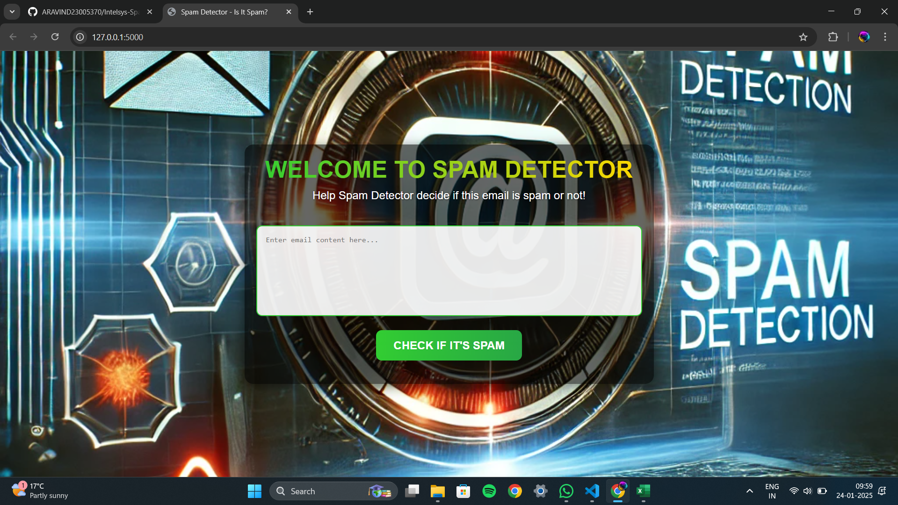
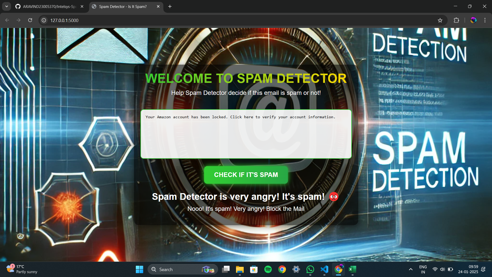

# TITLE:
Spam Detector Using Naive Bayes
# BRIEF EXPLANATION ABOUT THE WORKING MODEL:
This project is a machine learning-based spam filter that predicts whether a given email is spam or not. It processes email content and classifies it using a pre-trained model.


# ML ALGORITHM USED:
1) Algorithm: Naive Bayes (MultinomialNB)
2) How It Works: The Naive Bayes algorithm is a probabilistic classifier based on Bayes' theorem. It calculates the likelihood of an email being spam by analyzing the frequency of words in the email content, using the training data to predict the label (Spam or Not Spam).


# FRONT-END TECHNOLOGY USED:
1) Technology: HTML, CSS, and Flask Framework
2) Description:
   1) Flask: Used to create the backend for handling HTTP requests, routing, and integrating the ML model.
   2) HTML & CSS: Designed a simple, user-friendly interface where users can input email content and receive spam predictions.
   3) jQuery: Added interactivity for dynamic result updates without refreshing the page.

# STEP-BY-STEP EXPLANATION OF THE CODE:
## Model Code Explanation
1) Dataset Loading and Preprocessing:

* Loaded the dataset containing email content and corresponding labels (Spam or Not Spam).
* Renamed or created necessary columns to standardize the dataset (email column renamed to text).
* Converted labels into binary values (1 for Spam, 0 for Not Spam).

2) Training the Model:

* Split the dataset into training and testing sets (75% training, 25% testing).
* Used CountVectorizer to convert email content into a bag-of-words feature matrix.
* Trained a Multinomial Naive Bayes classifier on the training data.
3) Saving and Loading the Model:

* Serialized the trained model and vectorizer using Python’s pickle module for reuse without retraining.
4) Prediction API:

* Set up a Flask route (/predict) to handle POST requests.
* Transformed input email content using the saved vectorizer and made predictions using the model.

```
from flask import Flask, render_template, request, jsonify
import os
import pickle
import pandas as pd
from sklearn.model_selection import train_test_split
from sklearn.feature_extraction.text import CountVectorizer
from sklearn.naive_bayes import MultinomialNB

app = Flask(__name__)

# File paths for model and vectorizer
model_filename = 'spam_model.pkl'
vectorizer_filename = 'vectorizer.pkl'
data_file = r'C:\Users\admin\OneDrive\Desktop\SPAM FILTER\SPAM DATA SET\email_classification.csv'


def train_and_save_model():
    # Load the dataset
    df = pd.read_csv(data_file)

    # Handle missing columns or rename columns
    if 'email' in df.columns:
        df['text'] = df['email']
    elif 'content' in df.columns:
        df['text'] = df['content']
    else:
        raise ValueError("The dataset must have a column containing the email content (e.g., 'email' or 'content').")

    # Add a binary spam column based on the label
    df['spam'] = df['label'].apply(lambda x: 1 if x.lower() == 'spam' else 0)

    # Split the dataset
    X_train, X_test, y_train, y_test = train_test_split(
        df['text'], df['spam'], test_size=0.25, random_state=42, stratify=df['spam']
    )

    # Train the model
    vectorizer = CountVectorizer()
    X_train_vect = vectorizer.fit_transform(X_train)
    model = MultinomialNB()
    model.fit(X_train_vect, y_train)

    # Save the model and vectorizer
    with open(model_filename, 'wb') as model_file:
        pickle.dump(model, model_file)
    with open(vectorizer_filename, 'wb') as vectorizer_file:
        pickle.dump(vectorizer, vectorizer_file)

    print("Model and vectorizer saved successfully!")


# Check if model exists, else train it
if not os.path.exists(model_filename) or not os.path.exists(vectorizer_filename):
    print("Model or vectorizer not found. Training and saving new model...")
    train_and_save_model()

# Load the model and vectorizer
with open(model_filename, 'rb') as model_file:
    model = pickle.load(model_file)
with open(vectorizer_filename, 'rb') as vectorizer_file:
    vectorizer = pickle.load(vectorizer_file)


@app.route('/')
def index():
    return render_template('index.html')


@app.route('/predict', methods=['POST'])
def predict():
    if not model or not vectorizer:
        return jsonify({'error': 'Model or vectorizer not found. Please train the model first.'})

    # Get email content from the form
    email_content = request.form.get('email', '')
    if not email_content:
        return jsonify({'error': 'No email content provided.'})

    # Transform the email content using the vectorizer
    email_features = vectorizer.transform([email_content])

    # Predict the label
    prediction = model.predict(email_features)
    prediction_label = 'Spam' if prediction == 1 else 'Not Spam'

    return jsonify({'prediction': prediction_label})


if __name__ == '__main__':
    app.run(debug=True)


```


## Front-End Code Explanation
1) HTML:

* Created a simple form with a textarea input for users to enter email content.
* Added a button to submit the form data to the backend for prediction.
```
<!DOCTYPE html>
<html lang="en">
<head>
    <meta charset="UTF-8">
    <meta name="viewport" content="width=device-width, initial-scale=1.0">
    <title>Spam Detector - Is It Spam?</title>
    <link rel="stylesheet" href="{{ url_for('static', filename='styles.css') }}">
</head>
<body>
    <div class="container">
        <h1>Welcome to Spam Detector</h1>
        <p>Help Spam Detector decide if this email is spam or not!</p>

        <form id="emailForm">
            <textarea id="emailContent" name="email" rows="8" placeholder="Enter email content here..."></textarea>
            <br>
            <button type="submit">Check if it's Spam</button>
        </form>

        <div id="result" class="result">
            <!-- Result will appear here -->
        </div>
    </div>

    <script src="https://code.jquery.com/jquery-3.6.0.min.js"></script>
    <script>
        $('#emailForm').submit(function(event) {
            event.preventDefault();

            var emailContent = $('#emailContent').val();
            if (!emailContent) {
                alert("Please enter the email content.");
                return;
            }

            // Simulate checking the email
            $.ajax({
                url: '/predict',
                type: 'POST',
                data: { email: emailContent },
                success: function(response) {
                    if (response.prediction === 'Not Spam') {
                        $('#result').html('<h2>Spam Detector is happy! It\'s not spam! 😊</h2><p class="happyReaction">Yay! It\'s safe!</p>');
                    } else {
                        $('#result').html('<h2>Spam Detector is very angry! It\'s spam! 😡</h2><p class="angryReaction">Nooo! It\'s spam! Very angry! Block the Mail </p>');
                    }
                },
                error: function(error) {
                    $('#result').html('<h2>Error: ' + error.responseJSON.error + '</h2>');
                }
            });
        });
    </script>
</body>
</html>

```


2) CSS:

* Designed a visually appealing interface with gradient text, glowing buttons, and a responsive layout.
* Used animations (fade-in) and a semi-transparent background for a modern look.
```
/* Reset default styles */
* {
    margin: 0;
    padding: 0;
    box-sizing: border-box;
}

body {
    font-family: 'Arial', sans-serif;
    background: url('ref.webp') no-repeat center center fixed; /* Replace with your image */
    background-size: cover;
    height: 100vh;
    display: flex;
    justify-content: center;
    align-items: center;
    color: white;
}

/* Container for centering */
.container {
    text-align: center;
    padding: 20px;
    border-radius: 15px;
    background-color: rgba(0, 0, 0, 0.6); /* Semi-transparent black */
    box-shadow: 0 4px 20px rgba(0, 0, 0, 0.5); /* Subtle shadow */
    width: 90%;
    max-width: 700px;
    animation: fadeIn 1.5s ease-in-out;
}

/* Heading with gradient text */
h1 {
    font-size: 2.5em;
    margin-bottom: 10px;
    color: transparent;
    background: linear-gradient(90deg, #32CD32, #FFD700); /* Gradient effect */
    -webkit-background-clip: text;
    background-clip: text;
    text-transform: uppercase;
    font-weight: bold;
}

/* Description paragraph */
p {
    font-size: 1.2em;
    margin-bottom: 20px;
    color: #ffffff;
    text-shadow: 1px 1px 3px rgba(0, 0, 0, 0.6);
}

/* Textarea styling */
textarea {
    width: 100%;
    padding: 15px;
    margin: 20px 0;
    border-radius: 10px;
    border: 2px solid #32CD32;
    background-color: rgba(255, 255, 255, 0.9); /* Light background for text input */
    font-size: 1em;
    resize: none;
    outline: none;
    transition: box-shadow 0.3s;
}

textarea:focus {
    box-shadow: 0 0 10px #32CD32;
}

/* Button styling */
button {
    padding: 15px 30px;
    font-size: 1.2em;
    border: none;
    border-radius: 10px;
    background: linear-gradient(90deg, #32CD32, #28a745); /* Glowing green button */
    color: white;
    cursor: pointer;
    transition: transform 0.3s, box-shadow 0.3s;
    text-transform: uppercase;
    font-weight: bold;
}

button:hover {
    transform: scale(1.05);
    box-shadow: 0 0 15px #32CD32;
}

/* Result section */
.result {
    margin-top: 20px;
    text-align: center;
}

.result h2 {
    font-size: 1.8em;
    margin-bottom: 10px;
}

/* Fade-in animation */
@keyframes fadeIn {
    from {
        opacity: 0;
        transform: translateY(-20px);
    }
    to {
        opacity: 1;
        transform: translateY(0);
    }
}

```


3) JavaScript (jQuery):

* Added functionality to submit the form without reloading the page.
* Displayed the prediction result dynamically based on the backend response.


# OUTPUT:
### INTERFACE


### HAM 

 ### SPAM 
 


# RESULT:

The Spam Detector successfully classifies emails with high accuracy using the Naive Bayes algorithm. Its interactive front-end makes it easy to use and visually appealing. This project demonstrates the effective integration of machine learning with a web-based interface.

